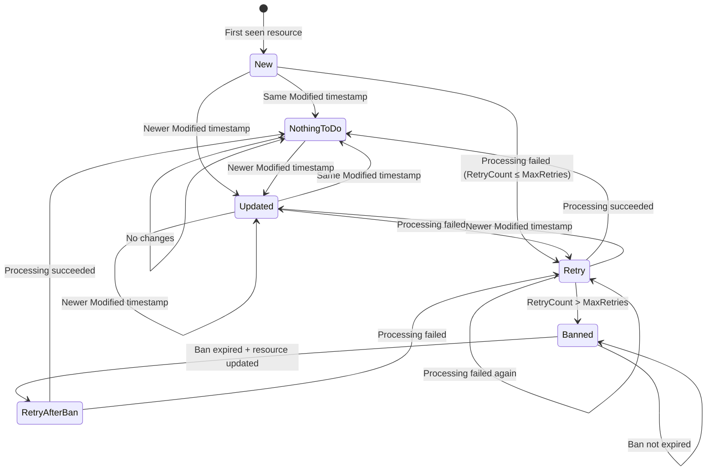

# Ark.Tools.ResourceWatcher

A polling-based ETL framework for watching external data providers, detecting changes, and processing resources with built-in retry and ban mechanisms.

## Overview

ResourceWatcher is a "smart" polling ETL that:
- **Watches** external providers via frequent listing
- **Detects** new or changed resources using timestamps or checksums
- **Fetches** only resources that need processing
- **Processes** resources with configurable parallelism
- **Tracks** state with retry counts and ban durations

Unlike scheduled batch ETL, ResourceWatcher enables **incremental loading** as soon as resources are available or modified.

## Getting Started

### Hello World Worker

```csharp
// 1. Define your metadata (what identifies a resource)
public class MyMetadata : IResourceMetadata
{
    public required string ResourceId { get; init; }
    public LocalDateTime Modified { get; init; }
    public Dictionary<string, LocalDateTime>? ModifiedSources { get; init; }
    public VoidExtensions? Extensions { get; init; }  // VoidExtensions for resources without extension data
}

// 2. Define your resource (the actual data)
public class MyResource : IResource<MyMetadata>
{
    public required MyMetadata Metadata { get; init; }
    public required string Data { get; init; }
    public string? CheckSum { get; init; }
    public Instant RetrievedAt { get; init; }
}

// 3. Implement the data provider
public class MyResourceProvider : IResourceProvider<MyMetadata, MyResource, object>
{
    public async Task<IEnumerable<MyMetadata>> GetMetadata(object filter, CancellationToken ctk = default)
    {
        // List available resources from external source
        return await _externalApi.ListResourcesAsync(ctk);
    }

    public async Task<MyResource?> GetResource(MyMetadata metadata, IResourceTrackedState? lastState, CancellationToken ctk = default)
    {
        // Fetch the actual resource content
        var data = await _externalApi.GetResourceAsync(metadata.ResourceId, ctk);
        return new MyResource
        {
            Metadata = metadata,
            Data = data,
            CheckSum = ComputeHash(data),
            RetrievedAt = SystemClock.Instance.GetCurrentInstant()
        };
    }
}

// 4. Implement the processor
public class MyResourceProcessor : IResourceProcessor<MyResource, MyMetadata>
{
    public async Task Process(MyResource file, CancellationToken ctk = default)
    {
        // Transform and load the resource
        await _sink.WriteAsync(file.Data, ctk);
    }
}

// 5. Configure and run
var host = new WorkerHost<MyResource, MyMetadata, object>(new MyHostConfig());
host.UseDataProvider<MyResourceProvider>();
host.AppendFileProcessor<MyResourceProcessor>();

await host.RunAsync(stoppingToken);
```

## State Machine

ResourceWatcher uses a state machine to track each resource's processing status:



### ProcessType States

| State | Description | Condition |
|-------|-------------|-----------|
| **New** | Resource seen for the first time | No previous state exists |
| **Updated** | Resource has newer Modified timestamp | `Current.Modified > LastState.Modified` |
| **NothingToDo** | Resource hasn't changed | Same Modified timestamp, RetryCount = 0 |
| **Retry** | Previous processing failed, retrying | `0 < RetryCount ≤ MaxRetries` |
| **Banned** | Exceeded max retries, within ban period | `RetryCount > MaxRetries && !BanExpired` |
| **RetryAfterBan** | Ban expired, resource updated | `RetryCount > MaxRetries && BanExpired && IsUpdated` |

### ResultType Outcomes

| Result | Description |
|--------|-------------|
| **Normal** | Processing completed successfully |
| **Error** | Processing threw an exception |
| **Skipped** | Resource was NothingToDo or Banned |

## Configuration

### IHostConfig Settings

```csharp
public class MyHostConfig : IHostConfig
{
    // Worker identification
    public string Tenant => "my-tenant";
    public string WorkerName => "MyWorker";
    
    // Polling interval between runs
    public TimeSpan Sleep => TimeSpan.FromMinutes(5);
    
    // Retry configuration
    public uint MaxRetries => 3;
    public Duration BanDuration => Duration.FromHours(24);
    
    // Parallelism
    public uint DegreeOfParallelism => 4;
    
    // Skip unchanged resources based on checksum
    public bool SkipResourceRetrivedIfNoChangedOfChecksum => true;
}
```

## Change Detection

### Skip-by-Version (Modified Timestamp)

The primary mechanism for detecting changes. The `Modified` property on `IResourceMetadata` is compared against the stored state:

```csharp
public class BlobMetadata : IResourceMetadata
{
    public required string ResourceId { get; init; }
    public LocalDateTime Modified { get; init; }  // Last modified timestamp from source
    // ...
}
```

### Skip-by-Hash (CheckSum)

After fetching a resource, its checksum is compared to detect content changes even when timestamps are unreliable:

```csharp
public class MyResource : IResource<MyMetadata>
{
    public string? CheckSum { get; init; }  // Hash of content
    // ...
}
```

### Multi-Versions (ModifiedSources)

For resources with multiple components that update independently:

```csharp
public class CompositeMetadata : IResourceMetadata
{
    public required string ResourceId { get; init; }
    public LocalDateTime Modified { get; init; }
    
    // Track multiple sources independently
    public Dictionary<string, LocalDateTime>? ModifiedSources { get; init; } = new()
    {
        ["header"] = headerModified,
        ["body"] = bodyModified,
        ["footer"] = footerModified
    };
}
```

When `ModifiedSources` is populated, the library compares each source's timestamp individually.

## Incremental Loading Patterns

### Cross-Resource Incremental

Detect new or changed resources across the entire dataset:

1. `GetMetadata` lists all resources with their `Modified` timestamps
2. Library compares with stored state to identify changes
3. Only new/updated resources proceed to Fetch phase

### Within-Resource Incremental (Append-Only)

For append-only resources like log files or growing datasets, use typed extensions to track incremental state:

```csharp
// 1. Define a typed extension for incremental state
public record AppendOnlyExtensions
{
    public long LastOffset { get; init; }
}

// 2. Use the typed extension in metadata
public class LogMetadata : IResourceMetadata<AppendOnlyExtensions>
{
    public required string ResourceId { get; init; }
    public LocalDateTime Modified { get; init; }
    public Dictionary<string, LocalDateTime>? ModifiedSources { get; init; }
    public AppendOnlyExtensions? Extensions { get; init; }
}

// 3. Implement provider with type-safe extension access
public class AppendOnlyProvider : IResourceProvider<LogMetadata, LogResource, object>
{
    public async Task<LogResource?> GetResource(
        LogMetadata metadata, 
        IResourceTrackedState<AppendOnlyExtensions>? lastState, 
        CancellationToken ctk = default)
    {
        // ✅ Type-safe access with IntelliSense - no runtime type checking needed
        var lastOffset = lastState?.Extensions?.LastOffset ?? 0L;

        // Fetch only new bytes (Range request)
        var (newBytes, newOffset) = await _api.GetBytesFromOffset(
            metadata.ResourceId, lastOffset, ctk);

        return new LogResource
        {
            Metadata = metadata with
            {
                // Store new offset for next run
                Extensions = new AppendOnlyExtensions { LastOffset = newOffset }
            },
            Data = newBytes,
            CheckSum = ComputeHash(newBytes),
            RetrievedAt = SystemClock.Instance.GetCurrentInstant()
        };
    }
}
```

**Flow:**
```
State: { "lastOffset": 1024 }
  ↓
Fetch bytes 1024+ from blob
  ↓
Compute checksum of new bytes
  ↓
Update State: { "lastOffset": 2048 }
```

## Type-Safe Extensions

ResourceWatcher provides compile-time type safety for extension data through generic type parameters. This feature eliminates runtime type checking and provides full IntelliSense support.

### Why Use Typed Extensions?

**Benefits:**
- ✅ **Compile-time type safety**: Catch extension-related errors at compile time
- ✅ **IntelliSense support**: Full IDE support for extension properties
- ✅ **AoT compatible**: Native AoT and trimming fully supported
- ✅ **No runtime reflection**: Zero overhead for type checking
- ✅ **Self-documenting**: Extension structure is explicit in code

### Basic Usage

For resources without extension data, use the non-generic interfaces (which default to `VoidExtensions`):

```csharp
public class SimpleMetadata : IResourceMetadata
{
    public required string ResourceId { get; init; }
    public LocalDateTime Modified { get; init; }
    public Dictionary<string, LocalDateTime>? ModifiedSources { get; init; }
    public VoidExtensions? Extensions { get; init; }
}

// WorkerHost automatically uses VoidExtensions
var host = new WorkerHost<MyResource, SimpleMetadata, object>(config);
```

### Defining Typed Extensions

For resources that need extension data, define a record or class with your extension properties:

```csharp
// 1. Define your extension type
public record BlobExtensions
{
    /// <summary>Last processed byte offset for incremental loading</summary>
    public long LastOffset { get; init; }
    
    /// <summary>ETag from last successful fetch for conditional requests</summary>
    public string? LastETag { get; init; }
    
    /// <summary>Timestamp of last successful processing</summary>
    public Instant? LastProcessed { get; init; }
}

// 2. Use the extension type in your metadata
public class BlobMetadata : IResourceMetadata<BlobExtensions>
{
    public required string ResourceId { get; init; }
    public LocalDateTime Modified { get; init; }
    public Dictionary<string, LocalDateTime>? ModifiedSources { get; init; }
    public BlobExtensions? Extensions { get; init; }
}

// 3. Update your resource interface
public class BlobResource : IResource<BlobMetadata, BlobExtensions>
{
    public required BlobMetadata Metadata { get; init; }
    public required byte[] Data { get; init; }
    public string? CheckSum { get; init; }
    public Instant RetrievedAt { get; init; }
}

// 4. Implement provider with type-safe access
public class BlobProvider : IResourceProvider<BlobMetadata, BlobResource, object, BlobExtensions>
{
    public async Task<BlobResource?> GetResource(
        BlobMetadata metadata,
        IResourceTrackedState<BlobExtensions>? lastState,
        CancellationToken ctk = default)
    {
        // ✅ Type-safe extension access with IntelliSense
        var lastOffset = lastState?.Extensions?.LastOffset ?? 0L;
        var lastETag = lastState?.Extensions?.LastETag;
        
        // Use extensions for conditional requests
        var response = await _blobClient.DownloadAsync(
            metadata.ResourceId,
            new BlobDownloadOptions
            {
                Range = new HttpRange(lastOffset),
                Conditions = new BlobRequestConditions
                {
                    IfNoneMatch = lastETag != null ? new ETag(lastETag) : null
                }
            },
            ctk);
        
        return new BlobResource
        {
            Metadata = metadata with
            {
                Extensions = new BlobExtensions
                {
                    LastOffset = lastOffset + response.Content.Length,
                    LastETag = response.Details.ETag.ToString(),
                    LastProcessed = SystemClock.Instance.GetCurrentInstant()
                }
            },
            Data = await BinaryData.FromStreamAsync(response.Content, ctk),
            CheckSum = ComputeHash(response.Content),
            RetrievedAt = SystemClock.Instance.GetCurrentInstant()
        };
    }
}

// 5. Configure WorkerHost with typed extensions
var host = new WorkerHost<BlobResource, BlobMetadata, object, BlobExtensions>(config);
host.UseDataProvider<BlobProvider>();
host.AppendFileProcessor<BlobProcessor>();
```

### Extension Serialization

Extensions are automatically serialized to JSON and stored in the state provider:

```sql
-- In SQL Server, extensions are stored as JSON
SELECT ResourceId, ExtensionsJson FROM [State]
-- {"lastOffset": 2048, "lastETag": "\"0x8D9...\""lastProcessed": "2024-01-15T10:30:00Z"}
```

### Common Extension Patterns

#### Incremental Offset Tracking

```csharp
public record OffsetExtensions
{
    public long LastOffset { get; init; }
    public long TotalBytesProcessed { get; init; }
}

// In provider
var lastOffset = lastState?.Extensions?.LastOffset ?? 0L;
var newOffset = await FetchFromOffset(lastOffset);

return resource with
{
    Metadata = metadata with
    {
        Extensions = new OffsetExtensions
        {
            LastOffset = newOffset,
            TotalBytesProcessed = (lastState?.Extensions?.TotalBytesProcessed ?? 0) + bytesRead
        }
    }
};
```

#### Cursor-Based Pagination

```csharp
public record PaginationExtensions
{
    public string? ContinuationToken { get; init; }
    public int PageNumber { get; init; }
}

// In provider
var token = lastState?.Extensions?.ContinuationToken;
var (items, nextToken) = await _api.GetPageAsync(token, ctk);

return resource with
{
    Metadata = metadata with
    {
        Extensions = new PaginationExtensions
        {
            ContinuationToken = nextToken,
            PageNumber = (lastState?.Extensions?.PageNumber ?? 0) + 1
        }
    }
};
```

#### Multi-Source Tracking

```csharp
public record MultiSourceExtensions
{
    public Dictionary<string, long> SourceOffsets { get; init; } = new();
    public Dictionary<string, string?> SourceETags { get; init; } = new();
}

// In provider
var headerOffset = lastState?.Extensions?.SourceOffsets.GetValueOrDefault("header") ?? 0;
var bodyOffset = lastState?.Extensions?.SourceOffsets.GetValueOrDefault("body") ?? 0;

// ... fetch from multiple sources ...

return resource with
{
    Metadata = metadata with
    {
        Extensions = new MultiSourceExtensions
        {
            SourceOffsets = new Dictionary<string, long>
            {
                ["header"] = newHeaderOffset,
                ["body"] = newBodyOffset
            },
            SourceETags = new Dictionary<string, string?>
            {
                ["header"] = headerETag,
                ["body"] = bodyETag
            }
        }
    }
};
```

## AoT and Trimming

ResourceWatcher v6 is fully compatible with Native AoT and trimming when using typed extensions with source-generated JSON contexts.

### Source-Generated JSON Context

For AoT deployment, provide a source-generated JSON context for your extension types:

```csharp
// 1. Define your extension type
public record MyExtensions
{
    public long LastOffset { get; init; }
    public string? LastETag { get; init; }
}

// 2. Create a JSON source generation context
[JsonSerializable(typeof(MyExtensions))]
[JsonSerializable(typeof(ResourceState<MyExtensions>))]
public partial class MyJsonContext : JsonSerializerContext { }

// 3. Register with SqlStateProvider
public class MyHostConfig : IHostConfig, ISqlStateProviderConfig
{
    public string Tenant => "my-tenant";
    public string WorkerName => "MyWorker";
    public string ConnectionString => _connectionString;
    
    // Provide source-generated context for AoT
    public JsonSerializerContext? JsonContext => MyJsonContext.Default;
}

// 4. Use in application startup
var host = new WorkerHost<MyResource, MyMetadata, object, MyExtensions>(config);
host.UseSqlStateProvider();  // Automatically uses JsonContext from config
```

### AoT Requirements

When deploying with Native AoT:

1. **Define typed extensions**: Use explicit types instead of anonymous objects
2. **Create JSON context**: Use `[JsonSerializable]` attributes for all extension types
3. **Register JSON context**: Provide `JsonSerializerContext` to `SqlStateProvider` via config
4. **Enable PublishAot**: Add `<PublishAot>true</PublishAot>` to your project file

```xml
<!-- MyWorker.csproj -->
<Project Sdk="Microsoft.NET.Sdk">
  <PropertyGroup>
    <OutputType>Exe</OutputType>
    <TargetFramework>net9.0</TargetFramework>
    <PublishAot>true</PublishAot>
  </PropertyGroup>
  
  <!-- Add ResourceWatcher packages -->
  <ItemGroup>
    <PackageReference Include="Ark.Tools.ResourceWatcher.WorkerHost" Version="6.0.0" />
    <PackageReference Include="Ark.Tools.ResourceWatcher.Sql" Version="6.0.0" />
  </ItemGroup>
</Project>
```

### Trimming Compatibility

ResourceWatcher v6 is fully trimmable with zero warnings:

```bash
# Publish with trimming enabled
dotnet publish -c Release /p:PublishTrimmed=true

# Should produce 0 trim warnings
```

If you encounter trim warnings, ensure:
- All extension types are registered in `JsonSerializerContext`
- No reflection-based JSON serialization is used
- `VoidExtensions` is used for resources without extension data

## State Providers

### In-Memory (Testing)

```csharp
// For unit/integration tests
var stateProvider = new TestableStateProvider();
host.Use(d => d.Container.RegisterInstance<IStateProvider>(stateProvider));
```

### SQL Server (Production)

```csharp
// Production-ready persistent state
host.UseSqlStateProvider(connectionString);
```

## Scoped Instances

Each resource is processed in its own scope, allowing per-resource dependency injection:

```csharp
host.UseDataProvider<MyProvider>(d =>
{
    // Singleton - shared across all resources
    d.Container.RegisterInstance(_sharedConfig);
});

host.AppendFileProcessor<MyProcessor>(d =>
{
    // Scoped - new instance per Run(), shared across all resources in the same Run()
    // Use this to share 'session' objects (e.g., connection to SFTP/DB) during a Run()
    d.Container.Register<ITransformService, TransformService>(Lifestyle.Scoped);
});
```

## Diagnostics

ResourceWatcher emits diagnostic events for monitoring and testing:

```csharp
// Subscribe to diagnostic events
DiagnosticListener.AllListeners.Subscribe(new MyDiagnosticObserver());

public class MyDiagnosticObserver : IObserver<DiagnosticListener>
{
    public void OnNext(DiagnosticListener listener)
    {
        if (listener.Name == "Ark.Tools.ResourceWatcher")
        {
            listener.Subscribe(new ResourceWatcherEventHandler());
        }
    }
}
```

### Available Events

| Event | Description |
|-------|-------------|
| `CheckState.Start` | Beginning state comparison |
| `CheckState.Stop` | State comparison complete (includes counts) |
| `ProcessResource.Start` | Beginning to process a resource |
| `ProcessResource.Stop` | Resource processing complete |

## Testing

Use `Ark.Tools.ResourceWatcher.Testing` for comprehensive testing:

### Basic Testing with VoidExtensions

```csharp
// TestableStateProvider for state assertions
var stateProvider = new TestableStateProvider();
stateProvider.SetState(tenant, resourceId, modified, null, null, 0, instant);

// After processing
var state = stateProvider.GetState(tenant, resourceId);
state.RetryCount.Should().Be(0);

// TestingDiagnosticListener for processing assertions
var listener = new TestingDiagnosticListener();
DiagnosticListener.AllListeners.Subscribe(listener);

// After processing
var result = listener.GetResult(resourceId);
result.ProcessType.Should().Be(ProcessType.New);
result.ResultType.Should().Be(ResultType.Normal);
```

### Testing with Typed Extensions

```csharp
// 1. Define test extension type
public record TestExtensions
{
    public long LastOffset { get; init; }
    public string? LastETag { get; init; }
}

// 2. Create state provider with typed extensions
var stateProvider = new TestableStateProvider<TestExtensions>();

// 3. Set initial state with extensions
stateProvider.SetState(
    tenant,
    resourceId,
    modified,
    null,
    new TestExtensions { LastOffset = 1024, LastETag = "etag1" },
    retryCount: 0,
    instant);

// 4. Assert extension state after processing
var state = stateProvider.GetState(tenant, resourceId);
state.Extensions?.LastOffset.Should().Be(2048);
state.Extensions?.LastETag.Should().Be("etag2");

// 5. Verify state transitions preserve extensions
state.RetryCount.Should().Be(0);
state.Modified.Should().Be(newModified);
```

### Integration Testing with SqlStateProvider

```csharp
// 1. Define JSON context for AoT-compatible testing
[JsonSerializable(typeof(TestExtensions))]
[JsonSerializable(typeof(ResourceState<TestExtensions>))]
public partial class TestJsonContext : JsonSerializerContext { }

// 2. Create SqlStateProvider with source-generated context
var config = new SqlStateProviderConfig
{
    Tenant = "test-tenant",
    ConnectionString = _testDbConnectionString,
    JsonContext = TestJsonContext.Default
};

var stateProvider = new SqlStateProvider<TestExtensions>(
    config,
    connectionManager,
    TestJsonContext.Default.Options);

// 3. Save and load state with extensions
var originalState = new ResourceState<TestExtensions>
{
    Tenant = "test-tenant",
    ResourceId = "resource-1",
    Modified = new LocalDateTime(2024, 1, 15, 10, 30),
    Extensions = new TestExtensions
    {
        LastOffset = 1024,
        LastETag = "original-etag"
    },
    RetryCount = 0,
    LastEvent = Instant.FromUtc(2024, 1, 15, 10, 30)
};

await stateProvider.SaveStateAsync(new[] { originalState }, ctk);

// 4. Load and verify
var loaded = await stateProvider.LoadStateAsync("test-tenant", ctk);
var loadedState = loaded.Single();

loadedState.Extensions?.LastOffset.Should().Be(1024);
loadedState.Extensions?.LastETag.Should().Be("original-etag");
```

### Testing State Transitions

```csharp
// Test incremental offset updates
var provider = new TestableStateProvider<OffsetExtensions>();

// Initial state
provider.SetState(tenant, resourceId, baseModified, null,
    new OffsetExtensions { LastOffset = 0 },
    retryCount: 0, instant);

// Simulate resource update
var newExtensions = new OffsetExtensions { LastOffset = 1024 };
provider.SetState(tenant, resourceId, newModified, null,
    newExtensions, retryCount: 0, instant.Plus(Duration.FromMinutes(5)));

// Verify offset advanced
var state = provider.GetState(tenant, resourceId);
state.Extensions?.LastOffset.Should().Be(1024);

// Simulate another update
provider.SetState(tenant, resourceId, newModified2, null,
    new OffsetExtensions { LastOffset = 2048 },
    retryCount: 0, instant.Plus(Duration.FromMinutes(10)));

state = provider.GetState(tenant, resourceId);
state.Extensions?.LastOffset.Should().Be(2048);
```

## Packages

| Package | Description |
|---------|-------------|
| `Ark.Tools.ResourceWatcher` | Core polling engine and interfaces |
| `Ark.Tools.ResourceWatcher.WorkerHost` | SimpleInjector-based worker host |
| `Ark.Tools.ResourceWatcher.Sql` | SQL Server state provider |
| `Ark.Tools.ResourceWatcher.WorkerHost.Sql` | SQL integration for WorkerHost |
| `Ark.Tools.ResourceWatcher.Testing` | Testing utilities |

## Best Practices

1. **ResourceIds MUST be unique**: ResourceId MUST uniquely identify a specific resource - include enough context to ensure uniqueness
2. **Use typed extensions for incremental state**: Define explicit extension types instead of anonymous objects for better type safety and AoT compatibility
3. **Use VoidExtensions when not needed**: For resources without extension data, use the non-generic interfaces that default to `VoidExtensions`
4. **Implement idempotent processors**: Resources may be reprocessed on failures
5. **Checksums are optional**: Use checksums for unreliable timestamps when sources don't update Modified reliably, but they are not required
6. **Use default BanDuration unless needed**: The default BanDuration is typically sufficient; only customize if you have specific requirements
7. **Provide JSON context for AoT**: When deploying with Native AoT, create a source-generated `JsonSerializerContext` for your extension types
8. **Configure parallelism carefully**: Balance throughput vs. API rate limits
