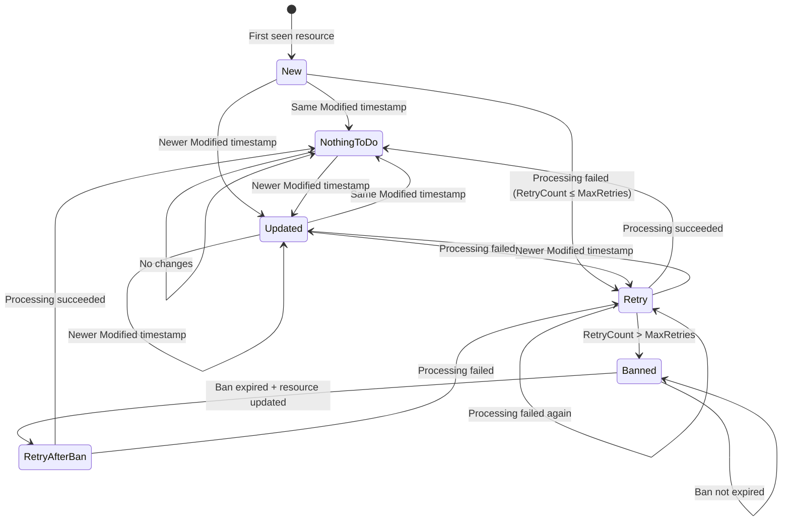

# Ark.Tools.ResourceWatcher

A polling-based ETL framework for watching external data providers, detecting changes, and processing resources with built-in retry and ban mechanisms.

## Overview

ResourceWatcher is a "smart" polling ETL that:
- **Watches** external providers via frequent listing
- **Detects** new or changed resources using timestamps or checksums
- **Fetches** only resources that need processing
- **Processes** resources with configurable parallelism
- **Tracks** state with retry counts and ban durations

Unlike scheduled batch ETL, ResourceWatcher enables **incremental loading** as soon as resources are available or modified.

## Getting Started

### Hello World Worker

```csharp
// 1. Define your metadata (what identifies a resource)
public class MyMetadata : IResourceMetadata
{
    public required string ResourceId { get; init; }
    public LocalDateTime Modified { get; init; }
    public Dictionary<string, LocalDateTime>? ModifiedSources { get; init; }
    public object? Extensions { get; init; }
}

// 2. Define your resource (the actual data)
public class MyResource : IResource<MyMetadata>
{
    public required MyMetadata Metadata { get; init; }
    public required string Data { get; init; }
    public string? CheckSum { get; init; }
    public Instant RetrievedAt { get; init; }
}

// 3. Implement the data provider
public class MyResourceProvider : IResourceProvider<MyMetadata, MyResource, object>
{
    public async Task<IEnumerable<MyMetadata>> GetMetadata(object filter, CancellationToken ctk = default)
    {
        // List available resources from external source
        return await _externalApi.ListResourcesAsync(ctk);
    }

    public async Task<MyResource?> GetResource(MyMetadata metadata, IResourceTrackedState? lastState, CancellationToken ctk = default)
    {
        // Fetch the actual resource content
        var data = await _externalApi.GetResourceAsync(metadata.ResourceId, ctk);
        return new MyResource
        {
            Metadata = metadata,
            Data = data,
            CheckSum = ComputeHash(data),
            RetrievedAt = SystemClock.Instance.GetCurrentInstant()
        };
    }
}

// 4. Implement the processor
public class MyResourceProcessor : IResourceProcessor<MyResource, MyMetadata>
{
    public async Task Process(MyResource file, CancellationToken ctk = default)
    {
        // Transform and load the resource
        await _sink.WriteAsync(file.Data, ctk);
    }
}

// 5. Configure and run
var host = new WorkerHost<MyResource, MyMetadata, object>(new MyHostConfig());
host.UseDataProvider<MyResourceProvider>();
host.AppendFileProcessor<MyResourceProcessor>();

await host.RunAsync(stoppingToken);
```

## State Machine

ResourceWatcher uses a state machine to track each resource's processing status:



### ProcessType States

| State | Description | Condition |
|-------|-------------|-----------|
| **New** | Resource seen for the first time | No previous state exists |
| **Updated** | Resource has newer Modified timestamp | `Current.Modified > LastState.Modified` |
| **NothingToDo** | Resource hasn't changed | Same Modified timestamp, RetryCount = 0 |
| **Retry** | Previous processing failed, retrying | `0 < RetryCount ≤ MaxRetries` |
| **Banned** | Exceeded max retries, within ban period | `RetryCount > MaxRetries && !BanExpired` |
| **RetryAfterBan** | Ban expired, resource updated | `RetryCount > MaxRetries && BanExpired && IsUpdated` |

### ResultType Outcomes

| Result | Description |
|--------|-------------|
| **Normal** | Processing completed successfully |
| **Error** | Processing threw an exception |
| **Skipped** | Resource was NothingToDo or Banned |

## Configuration

### IHostConfig Settings

```csharp
public class MyHostConfig : IHostConfig
{
    // Worker identification
    public string Tenant => "my-tenant";
    public string WorkerName => "MyWorker";
    
    // Polling interval between runs
    public TimeSpan Sleep => TimeSpan.FromMinutes(5);
    
    // Retry configuration
    public uint MaxRetries => 3;
    public Duration BanDuration => Duration.FromHours(24);
    
    // Parallelism
    public uint DegreeOfParallelism => 4;
    
    // Skip unchanged resources based on checksum
    public bool SkipResourceRetrivedIfNoChangedOfChecksum => true;
}
```

## Change Detection

### Skip-by-Version (Modified Timestamp)

The primary mechanism for detecting changes. The `Modified` property on `IResourceMetadata` is compared against the stored state:

```csharp
public class BlobMetadata : IResourceMetadata
{
    public required string ResourceId { get; init; }
    public LocalDateTime Modified { get; init; }  // Last modified timestamp from source
    // ...
}
```

### Skip-by-Hash (CheckSum)

After fetching a resource, its checksum is compared to detect content changes even when timestamps are unreliable:

```csharp
public class MyResource : IResource<MyMetadata>
{
    public string? CheckSum { get; init; }  // Hash of content
    // ...
}
```

### Multi-Versions (ModifiedSources)

For resources with multiple components that update independently:

```csharp
public class CompositeMetadata : IResourceMetadata
{
    public required string ResourceId { get; init; }
    public LocalDateTime Modified { get; init; }
    
    // Track multiple sources independently
    public Dictionary<string, LocalDateTime>? ModifiedSources { get; init; } = new()
    {
        ["header"] = headerModified,
        ["body"] = bodyModified,
        ["footer"] = footerModified
    };
}
```

When `ModifiedSources` is populated, the library compares each source's timestamp individually.

## Incremental Loading Patterns

### Cross-Resource Incremental

Detect new or changed resources across the entire dataset:

1. `GetMetadata` lists all resources with their `Modified` timestamps
2. Library compares with stored state to identify changes
3. Only new/updated resources proceed to Fetch phase

### Within-Resource Incremental (Append-Only)

For append-only resources like log files or growing datasets:

```csharp
public class AppendOnlyProvider : IResourceProvider<LogMetadata, LogResource, object>
{
    public async Task<LogResource?> GetResource(
        LogMetadata metadata, 
        IResourceTrackedState? lastState, 
        CancellationToken ctk = default)
    {
        // Read last offset from Extensions
        long lastOffset = 0;
        if (lastState?.Extensions is JsonElement ext && 
            ext.TryGetProperty("lastOffset", out var offsetProp))
        {
            lastOffset = offsetProp.GetInt64();
        }

        // Fetch only new bytes (Range request)
        var (newBytes, newOffset) = await _api.GetBytesFromOffset(
            metadata.ResourceId, lastOffset, ctk);

        return new LogResource
        {
            Metadata = metadata,
            Data = newBytes,
            CheckSum = ComputeHash(newBytes),
            RetrievedAt = SystemClock.Instance.GetCurrentInstant(),
            // Store new offset for next run
            Extensions = new { lastOffset = newOffset }
        };
    }
}
```

**Flow:**
```
State: { "lastOffset": 1024 }
  ↓
Fetch bytes 1024+ from blob
  ↓
Compute checksum of new bytes
  ↓
Update State: { "lastOffset": 2048 }
```

## State Providers

### In-Memory (Testing)

```csharp
// For unit/integration tests
var stateProvider = new TestableStateProvider();
host.Use(d => d.Container.RegisterInstance<IStateProvider>(stateProvider));
```

### SQL Server (Production)

```csharp
// Production-ready persistent state
host.UseSqlStateProvider(connectionString);
```

## Scoped Instances

Each resource is processed in its own scope, allowing per-resource dependency injection:

```csharp
host.UseDataProvider<MyProvider>(d =>
{
    // Singleton - shared across all resources
    d.Container.RegisterInstance(_sharedConfig);
});

host.AppendFileProcessor<MyProcessor>(d =>
{
    // Scoped - new instance per resource
    d.Container.Register<ITransformService, TransformService>(Lifestyle.Scoped);
});
```

## Diagnostics

ResourceWatcher emits diagnostic events for monitoring and testing:

```csharp
// Subscribe to diagnostic events
DiagnosticListener.AllListeners.Subscribe(new MyDiagnosticObserver());

public class MyDiagnosticObserver : IObserver<DiagnosticListener>
{
    public void OnNext(DiagnosticListener listener)
    {
        if (listener.Name == "Ark.Tools.ResourceWatcher")
        {
            listener.Subscribe(new ResourceWatcherEventHandler());
        }
    }
}
```

### Available Events

| Event | Description |
|-------|-------------|
| `CheckState.Start` | Beginning state comparison |
| `CheckState.Stop` | State comparison complete (includes counts) |
| `ProcessResource.Start` | Beginning to process a resource |
| `ProcessResource.Stop` | Resource processing complete |

## Testing

Use `Ark.Tools.ResourceWatcher.Testing` for comprehensive testing:

```csharp
// TestableStateProvider for state assertions
var stateProvider = new TestableStateProvider();
stateProvider.SetState(tenant, resourceId, modified, null, null, 0, instant);

// After processing
var state = stateProvider.GetState(tenant, resourceId);
state.RetryCount.Should().Be(0);

// TestingDiagnosticListener for processing assertions
var listener = new TestingDiagnosticListener();
DiagnosticListener.AllListeners.Subscribe(listener);

// After processing
var result = listener.GetResult(resourceId);
result.ProcessType.Should().Be(ProcessType.New);
result.ResultType.Should().Be(ResultType.Normal);
```

## Packages

| Package | Description |
|---------|-------------|
| `Ark.Tools.ResourceWatcher` | Core polling engine and interfaces |
| `Ark.Tools.ResourceWatcher.WorkerHost` | SimpleInjector-based worker host |
| `Ark.Tools.ResourceWatcher.Sql` | SQL Server state provider |
| `Ark.Tools.ResourceWatcher.WorkerHost.Sql` | SQL integration for WorkerHost |
| `Ark.Tools.ResourceWatcher.Testing` | Testing utilities |

## Best Practices

1. **Use meaningful ResourceIds**: Include enough context to identify the resource uniquely
2. **Set appropriate BanDuration**: Long enough to avoid hammering failed resources, short enough to retry after fixes
3. **Implement idempotent processors**: Resources may be reprocessed on failures
4. **Use checksums for unreliable timestamps**: Some sources don't update Modified reliably
5. **Store incremental state in Extensions**: For append-only or cursor-based loading
6. **Configure parallelism carefully**: Balance throughput vs. API rate limits
