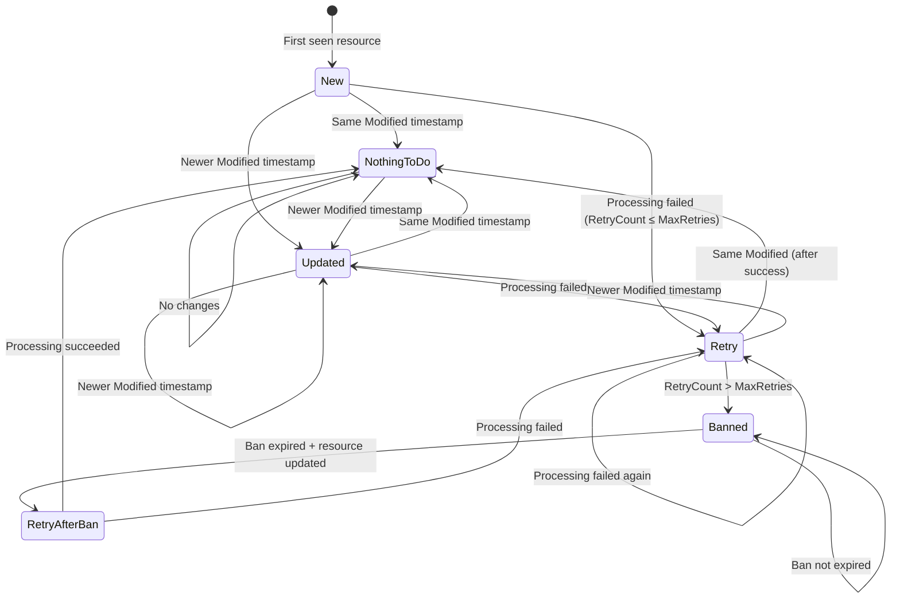

# Ark.Tools.ResourceWatcher Tests

This project contains comprehensive BDD tests for the `Ark.Tools.ResourceWatcher.*` packages using Reqnroll (formerly SpecFlow).

## Overview

The tests verify the state machine behavior of the ResourceWatcher polling-based ETL system. They cover all ProcessType transitions and error handling scenarios.

## State Machine Diagram



## ProcessType States

| State | Description | Condition |
|-------|-------------|-----------|
| **New** | Resource seen for the first time | No previous state exists |
| **Updated** | Resource has newer Modified timestamp | `Current.Modified > LastState.Modified` |
| **NothingToDo** | Resource hasn't changed | Same Modified timestamp, RetryCount = 0 |
| **Retry** | Previous processing failed, retrying | `0 < RetryCount ≤ MaxRetries` |
| **Banned** | Exceeded max retries, within ban period | `RetryCount > MaxRetries && !BanExpired` |
| **RetryAfterBan** | Ban expired, resource updated | `RetryCount > MaxRetries && BanExpired && IsUpdated` |

## ResultType Outcomes

| Result | Description |
|--------|-------------|
| **Normal** | Processing completed successfully |
| **Error** | Processing threw an exception |
| **Skipped** | Resource was NothingToDo or Banned |

## Test Scenarios

### New State Tests
- ✅ New resource is processed and stored
- ✅ New resource with ModifiedSources triggers processing

### Updated State Tests
- ✅ Resource with newer Modified timestamp is processed as Updated

### NothingToDo State Tests
- ✅ Resource with same Modified timestamp is skipped

### Retry State Tests
- ✅ Failed resource processing triggers retry
- ✅ Successful retry resets RetryCount to zero

### Ban State Tests
- ✅ Resource exceeding max retries is banned
- ✅ Banned resource is skipped during ban period

### Parallel Processing Tests
- ✅ Multiple new resources are processed in parallel

### Checksum Tests
- ✅ Resource checksum is stored in state after processing

## Running the Tests

### Prerequisites
- .NET 8.0 or .NET 10.0 SDK
- Docker (for integration tests with SQL state provider)

### Commands

```bash
# Run all tests
dotnet test --project tests/Ark.Tools.ResourceWatcher.Tests

# Run tests on specific framework
dotnet test --project tests/Ark.Tools.ResourceWatcher.Tests --framework net10.0

# Run tests with verbose output
dotnet test --project tests/Ark.Tools.ResourceWatcher.Tests --verbosity normal

# Run specific scenario by tag
dotnet test --project tests/Ark.Tools.ResourceWatcher.Tests --filter "Category=new-state"
```

## Project Structure

```
Ark.Tools.ResourceWatcher.Tests/
├── Features/
│   └── StateTransitions.feature    # BDD scenarios
├── Init/
│   ├── StubImplementations.cs      # Stub resource provider/processor
│   └── TestHost.cs                 # Test host configuration
├── Steps/
│   └── StateTransitionsSteps.cs    # Step definitions
├── docker-compose.yml              # Test dependencies
├── reqnroll.json                   # Reqnroll configuration
└── README.md                       # This file
```

## Testing Package

The `Ark.Tools.ResourceWatcher.Testing` package provides utilities for testing Workers:

### TestableStateProvider

In-memory implementation of `IStateProvider` for unit/integration tests:

```csharp
var stateProvider = new TestableStateProvider();

// Set initial state for a resource
stateProvider.SetState("tenant", "resourceId", modified, modifiedSources, checkSum, retryCount, lastEvent);

// Check state after processing
var state = stateProvider.GetState("tenant", "resourceId");
Assert.Equal(0, state.RetryCount);

// Check if resource is banned
bool isBanned = stateProvider.IsBanned("tenant", "resourceId", maxRetries: 3);
```

### TestingDiagnosticListener

Captures diagnostic events for assertions:

```csharp
var listener = new TestingDiagnosticListener();
DiagnosticListener.AllListeners.Subscribe(listener);

// Run watcher...

// Assert processing results
var result = listener.GetResult("resourceId");
Assert.Equal(ProcessType.New, result.ProcessType);
Assert.Equal(ResultType.Normal, result.ResultType);

// Check counts by process type
var newResources = listener.GetResourcesByProcessType(ProcessType.New);
Assert.Equal(3, newResources.Count);

// Check aggregate results
var checkState = listener.LatestCheckStateResult;
Assert.Equal(0, checkState.ResourcesBanned);
```

## Writing New Tests

1. Add scenarios to `Features/StateTransitions.feature` using Gherkin syntax
2. If needed, add step definitions in `Steps/StateTransitionsSteps.cs`
3. Use the Background section for common setup (MaxRetries, BanDuration)
4. Run tests incrementally after adding each scenario

### Example Scenario

```gherkin
@custom-tag
Scenario: Custom resource processing behavior
    Given a resource "my-resource" with Modified "2024-01-15T10:00:00"
    And the resource has not been seen before
    When the ResourceWatcher runs
    Then the resource "my-resource" should be processed as "New"
    And the state for "my-resource" should have RetryCount of 0
```

## Known Limitations

1. **Time-based tests**: The ResourceWatcher uses `SystemClock.Instance` internally, which cannot be mocked. Ban duration tests use "LastEvent now" to work with real time.

2. **Checksum detection**: Checksums are stored but not used for update detection. Updates are triggered only by Modified timestamp changes.

3. **ModifiedSources**: When `ModifiedSources` is populated, the Modified timestamp is ignored in favor of per-source timestamps.

## Related Packages

- `Ark.Tools.ResourceWatcher` - Core polling engine
- `Ark.Tools.ResourceWatcher.WorkerHost` - SimpleInjector-based worker host
- `Ark.Tools.ResourceWatcher.Sql` - SQL Server state provider
- `Ark.Tools.ResourceWatcher.Testing` - Testing utilities
